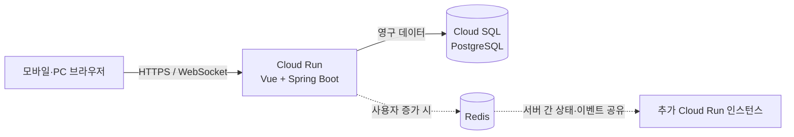

# 실시간 미니게임 플랫폼 개발 의사결정 기록

> 이 문서는 프로젝트 기획부터 설계, 구현, 테스트, 배포까지의 주요 의사결정과 근거를 한곳에 누적하는 포트폴리오용 기록이다. 결정이 변경되면 기존 내용을 삭제하지 않고, 새로운 결정으로 대체되었음을 남긴다.

## 1. 프로젝트 개요

- 프로젝트 유형: 모바일·PC 웹 기반 실시간 멀티플레이 미니게임 플랫폼
- 핵심 경험: 친구 또는 공개 사용자와 방을 만들고, 짧은 게임을 함께 플레이한다.
- 현재 단계: 요구사항 구체화 및 아키텍처 설계
- 기록 시작일: 2026-08-23

### 해결하려는 문제

친구들이 별도 프로그램을 설치하지 않고 링크나 방 코드를 통해 빠르게 모여 여러 종류의 파티게임을 즐길 수 있도록 한다. 1차 배포부터 공개 로비도 제공해 친구 중심 플레이와 공개 사용자 유입을 함께 검증하며, 새로운 게임을 독립적으로 확장할 수 있어야 한다.

### 1차 개발 성공 기준

1. 휴대폰과 PC 브라우저에서 동일한 방에 참가할 수 있다.
2. 공개 방과 비공개 방을 모두 만들 수 있다.
3. 게스트와 Google 로그인 사용자가 함께 플레이할 수 있다.
4. 네 가지 1차 게임이 공통 방 시스템 위에서 동작한다.
5. 연결이 잠시 끊겨도 사용자가 방에 재접속할 수 있다.
6. 이후 게임을 추가할 때 기존 로비와 방 기능을 수정하지 않아도 된다.

## 2. 확정된 제품 범위

### 사용자와 인증

- Google 로그인을 지원한다.
- 로그인은 필수가 아니며, 게스트는 닉네임만 입력해 즉시 참가할 수 있다.
- 로그인 사용자는 프로필과 게임 전적을 영구 보관할 수 있다.
- 게스트 데이터는 일회성 세션을 기본으로 한다.

### 로비와 방

- 공개 방은 로비 목록에서 찾아 참가할 수 있다.
- 비공개 방은 방 코드와 초대 링크로 참가할 수 있다.
- 공개·비공개 여부와 별개로 방 비밀번호는 선택적으로 설정할 수 있다.
- 방장은 게임, 라운드 수, 제한 시간 등 게임별 설정을 변경하고 게임을 시작한다.
- 각 게임이 자체적으로 최소·최대 참가 인원을 선언한다.
- 방 생성 화면에서는 제목, 공개 여부, 선택적 비밀번호, 첫 게임만 입력한다. 최대 인원과 게임별 세부 설정은 생성 후 대기방에서 조정한다.
- 비밀번호 원문은 생성 이후 누구에게도 다시 표시하지 않으며 방장은 새 비밀번호로 변경하거나 해제할 수만 있다.
- 현재 활성 참가자 수보다 최대 인원을 낮추는 변경은 차단한다. 새 게임의 최대 인원보다 참가자가 많을 때도 해당 게임으로 변경할 수 없다.
- 게임 진행 중에는 게임 종류와 라운드·시간·카테고리 설정을 변경할 수 없다. 방 잠금, 채팅 관리, 강퇴와 재입장 차단 같은 운영 권한은 계속 사용할 수 있다.
- 방장 위임이 완료되면 기존 방장의 관리 권한은 즉시 회수한다. 방 코드는 방이 종료될 때까지 유지한다.
- 게임은 선택한 게임의 최소 인원을 충족하고 관전자를 제외한 모든 활성 참가자가 준비했을 때만 시작할 수 있다.
- 방장이 게임 종류나 게임 설정을 변경하면 모든 참가자의 준비 상태를 해제한다. 참가자는 변경된 내용을 확인한 뒤 다시 준비한다.
- 시작 요청의 인원, 준비 상태, 방장 권한은 서버가 최종 검증한다.
- 마지막 사용자의 30초 재접속 유예가 끝나면 방을 즉시 종료하고 공개 로비에서 제거한다.
- 종료된 방의 실시간 상태와 비밀번호는 폐기한다. 완료된 게임 결과와 신고·제재에 필요한 최소 문맥만 별도 스냅샷으로 보존한다.

### 커뮤니케이션

- 1차 개발에서는 방 단위 텍스트 채팅을 지원한다.
- 대기방에서도 채팅을 사용할 수 있으며, 같은 방의 채팅 흐름은 게임 시작과 종료 뒤 대기방 복귀까지 이어진다.
- 데스크톱에서는 채팅 패널을 상시 노출하고, 모바일에서는 하단 고정 채팅 버튼과 읽지 않은 메시지 수를 표시해 하단 시트로 연다.
- 음성·영상 채팅은 1차 범위에서 제외한다.
- 공개 운영에 필요한 사용자 음소거와 시스템 메시지는 포함한다.

### 공개 운영과 신고

- 1차 배포부터 공개 방을 전체 사용자에게 개방한다.
- 사용자는 다른 사용자의 채팅을 개인적으로 음소거하고 사용자 또는 특정 메시지를 신고할 수 있다.
- 방장은 참가자 강퇴, 해당 방 재입장 차단, 방 잠금, 공개 상태 변경, 채팅 일시 중지·느린 모드, 방장 위임 권한을 가진다.
- 시스템은 닉네임·방 제목 금칙어, 채팅 도배, 정답 반복 제출, 비밀번호 대입, 공개 채팅의 외부 링크를 제한한다.
- 신고가 접수되어도 신고 수만으로 자동 정지하지 않는다. 관리자 검토를 위해 방, 메시지, 대상 사용자와 처리 문맥을 보관한다.
- 관리자 화면에서 신고 처리, 회원 일시 정지, 게스트 세션 차단, 공개 방 강제 종료, 제재 이력 기록을 지원한다.
- 게스트 반복 악용 제한에는 단기 세션 정보와 IP의 비가역 해시를 사용하며 원본 IP는 장기 저장하지 않는다.
- 이용약관, 개인정보 처리방침, 커뮤니티 규칙 링크를 로그인·게스트 입장 화면에 표시한다.

### 1차 게임

1. 라이어 게임
2. 그림 퀴즈
3. 초성 퀴즈
4. 다수결 예측

게임마다 참가 인원, 라운드 진행, 제한 시간, 점수 계산 규칙을 독립적으로 정의한다. 추후 1인·2인 게임도 동일한 등록 방식으로 추가할 수 있어야 한다.

## 3. 선택한 기술 스택

### 프론트엔드

- Vue 3
- TypeScript
- Vite
- Pinia
- 반응형 웹 UI
- HTTP API와 STOMP over WebSocket 클라이언트

### 백엔드

- Java + Spring Boot
- Spring Security
- OAuth 2.0 기반 Google 로그인
- REST API
- Spring WebSocket + STOMP
- OpenAPI/Swagger
- Flyway 데이터베이스 마이그레이션

### 데이터와 인프라

- 주 데이터베이스: PostgreSQL
- 1차 실행 환경: Google Cloud Run 서울 리전
- 관리형 데이터베이스: Google Cloud SQL for PostgreSQL 서울 리전
- 패키징: 표준 Docker/OCI 이미지
- 초기 실시간 게임 상태: 단일 서버 메모리
- 확장 단계의 공유 상태 및 이벤트: Redis

## 4. 승인된 1차 아키텍처



### 요청 처리 구분

- REST API: 로그인, 프로필, 공개 방 목록, 방 생성·조회, 전적 조회
- WebSocket/STOMP: 참가자 입장·퇴장, 준비 상태, 채팅, 타이머, 게임 이벤트, 점수 갱신
- PostgreSQL: 회원, 문제 데이터, 시작·완료·중단 게임 세션과 당시 방 설정 스냅샷, 전적, 신고·제재
- 서버 메모리: 현재 참가자, 진행 중 라운드, 제출·투표 상태, 임시 타이머

### 초기 단일 서버를 선택한 이유

- 개발 초기에 분산 상태 동기화보다 실제 게임 경험 검증이 더 중요하다.
- 단일 서버에서는 방과 게임 상태를 일관되게 처리하기 쉽다.
- Vue 결과물을 Spring Boot와 동일 출처로 제공하면 CORS, 쿠키, OAuth 콜백 구성이 단순해진다.
- 게임 상태 저장소를 인터페이스로 분리해 추후 Redis 구현으로 교체할 수 있다.

### 수용한 초기 제약

- Cloud Run 인스턴스가 재시작되면 진행 중인 게임은 종료될 수 있다.
- 완료된 결과와 계정 정보는 PostgreSQL에 남는다.
- 클라이언트는 WebSocket 연결 종료를 감지하고 자동 재접속해야 한다.
- 사용자가 증가하면 Redis와 다중 Cloud Run 인스턴스를 도입한다.

### 백엔드 모듈 경계

백엔드는 입력 어댑터, 응용 서비스, 순수 도메인, 출력 어댑터로 나눈다.

- 입력 어댑터: REST Controller, STOMP Message Gateway, 관리자 API. 외부 요청을 내부 명령으로 변환하고 응답을 표현한다.
- 응용 서비스: 인증과 권한, 트랜잭션, 방·게임 유스케이스의 실행 순서를 조정한다.
- 순수 도메인: `Room`, 공통 `GameEngine`, 네 게임 모듈, 운영 정책. Spring, JPA, WebSocket 타입에 의존하지 않는다.
- 출력 포트와 어댑터: PostgreSQL 저장소, 메모리·Redis 상태 저장소, Google OAuth 클라이언트, 이벤트 방송 구현.

Controller와 Message Gateway에는 게임 규칙을 작성하지 않으며, 게임 모듈은 저장소를 직접 호출하지 않는다. 응용 서비스가 도메인 명령을 실행하고 생성된 이벤트를 저장·방송한다.

실시간 이벤트는 `version`, `eventId`, `requestId`, `roomId`, `actorId`, `type`, `sequence`, `occurredAt`, `payload`를 포함하는 공통 봉투를 사용한다. 클라이언트는 `sequence`로 누락과 역순을 감지하고 필요할 때 전체 상태 스냅샷을 다시 요청한다. 사용자별 비밀 정보는 해당 사용자 목적지로만 전송한다.

### 사용자 이동 흐름

```text
홈 → 공개 로비 또는 초대 경로 → 대기방 → 게임 진행 → 결과 → 재경기·게임 변경·로비 복귀
```

- 홈에서는 Google 로그인 또는 게스트 닉네임을 선택한다.
- 공개 사용자는 로비의 방 목록, 친구는 코드나 초대 링크로 방에 접근한다.
- 초대 링크 사용자는 로그인·게스트 선택과 비밀번호 확인 후 로비를 거치지 않고 대기방으로 이동한다.
- 대기방에서는 참가자, 채팅, 선택 게임, 게임 설정, 준비 상태를 확인한다.
- 게임 중 입장한 사용자는 관전 상태로 대기하고 다음 라운드부터 참여한다.
- 방장이 이탈하면 입장 순서가 가장 빠른 활성 참가자에게 권한을 자동 위임한다.
- 최소 인원이 충족되지 않으면 시작을 차단하고 필요한 인원을 안내한다.
- 연결이 끊기면 같은 세션으로 자동 재접속하고, 복구할 수 없으면 이유와 이동 가능한 화면을 안내한다.

### 프론트엔드 모듈과 화면 구조

Vue 애플리케이션은 화면 종류가 아니라 제품 기능을 기준으로 나눈다. 최상위 경로는 홈(`/`), 공개 로비(`/lobby`), 방(`/rooms/:code`), 프로필(`/profile`), 관리자(`/admin`)다. 기능 모듈은 `auth`, `lobby`, `room`, `games`, `moderation`으로 구성하고, HTTP·실시간 연결처럼 여러 기능에서 사용하는 코드는 `apiClient`, `realtimeClient`, `eventSequencer`, `session`, `telemetry` 서비스로 분리한다.

Pinia 상태는 책임에 따라 `authStore`, `lobbyStore`, `roomStore`, `gameSessionStore`로 나눈다. 서버 이벤트를 컴포넌트가 직접 해석하지 않고 실시간 클라이언트와 이벤트 순서 처리기를 거쳐 해당 저장소에 반영한다. 게임별 UI는 게임 레지스트리가 `gameType`을 설정·플레이·결과 컴포넌트와 이벤트 payload 파서에 연결한다. 따라서 새 게임은 공통 방 화면의 조건문을 늘리지 않고 등록 방식으로 추가할 수 있다.

게임 화면은 데스크톱에서 게임 영역 약 70%, 참가자·채팅 영역 약 30%로 배치한다. 모바일에서는 게임을 최우선으로 보여주고 참가자와 채팅을 하단 시트로 연다. 같은 기능을 기기별로 따로 구현하지 않고 반응형 배치만 변경한다.

### 공개 로비 화면

- 상단에서 `방 만들기`와 `방 코드로 입장`을 가장 먼저 노출한다.
- 게임 종류 칩, 제목 검색, 입장 가능 여부, 정렬을 제공하되 초기 목록은 바로 입장할 수 있는 방을 우선한다.
- 방 카드에는 게임, 대기·진행 상태, 비밀번호 여부, 현재·최대 인원, 방장 정보를 색상뿐 아니라 텍스트와 아이콘으로 함께 표시한다.
- 진행 중인 방을 선택하면 관전 후 다음 라운드 참여라는 조건을 입장 전에 명확히 안내한다.
- 데스크톱은 카드 그리드, 모바일은 한 손으로 훑기 쉬운 압축 목록을 사용한다.
- 최초 목록은 REST 스냅샷으로 받고 이후 생성, 인원, 상태, 삭제 변화는 로비 STOMP 구독으로 증분 반영한다. 이벤트 누락을 감지하면 목록 스냅샷을 다시 조회한다.

## 5. 확장 가능한 게임 구조

공통 게임 엔진은 방과 게임의 생명주기만 담당한다.

```text
대기 → 참가자 검증 → 게임 시작 → 라운드 반복 → 결과 집계 → 대기방 복귀
```

각 게임 모듈은 다음 계약을 구현한다.

- 게임 식별자와 표시 정보
- 최소·최대 참가 인원
- 게임별 설정 스키마
- 초기 상태 생성
- 플레이어 명령 검증과 처리
- 제한 시간 만료 처리
- 공개 상태와 사용자별 비공개 상태 생성
- 라운드 종료 및 최종 점수 계산

이 경계를 통해 라이어 게임의 비밀 역할, 그림 퀴즈의 드로잉 이벤트, 초성 퀴즈의 선착순 정답, 다수결 예측의 비공개 선택을 같은 방 시스템에서 처리한다.

### 라이어 게임 규칙

- 권장 인원은 4~10명이며 라이어는 1명이다.
- 시민은 카테고리와 제시어를 받고, 라이어는 카테고리만 받는다.
- 각 라운드는 역할 배정, 무작위 순서의 한 문장 힌트, 90초 토론, 비공개 동시 투표, 라이어의 역전 추측 순서로 진행한다.
- 제시어 직접 입력, 빈 힌트, 자기 자신에 대한 투표는 서버가 차단한다.
- 최다 득표 동률이면 동률 후보만 한 번 재투표한다. 다시 동률이면 라이어가 생존한다.
- 시민은 라이어를 찾고 역전 추측도 막으면 각 1점을 얻는다.
- 라이어는 투표에서 생존하면 3점, 지목된 뒤 제시어를 맞히면 2점을 얻는다.
- 방장은 라운드 수 1~5, 힌트 제한시간 15~45초, 토론시간 60~180초, 카테고리 팩을 설정한다.

### 그림 퀴즈 규칙

- 권장 인원은 2~10명이며 참가자 순서를 섞어 모두 한 번씩 출제한다.
- 출제자는 세 개의 단어 후보 중 하나를 10초 안에 고르고, 선택하지 않으면 서버가 자동 선택한다.
- 기본 그리기 시간은 80초다.
- 펜 색상·굵기, 지우개, 마지막 획 되돌리기, 전체 지우기를 지원한다. 텍스트, 도형, 스탬프 도구는 제공하지 않는다.
- 채팅과 정답 제출은 하나의 입력창을 사용한다. 서버가 정답을 먼저 판정해 정답 내용은 숨기고 성공 알림만 전송하며, 오답은 일반 채팅으로 공개한다.
- `정답은` 같은 접두어와 공백·대소문자·일반 문장부호를 정규화하고 등록된 별칭을 허용한다. 정답 또는 별칭을 포함한 메시지는 채팅에 노출하지 않는다.
- 정답자는 남은 시간에 따라 100~1,000점을 얻고, 출제자는 정답자 한 명당 100점을 얻되 턴당 최대 500점으로 제한한다.
- 한 턴에 한 번 건너뛰기를 허용한다.
- 서버는 현재 턴의 획 이벤트를 메모리에 보관해 재접속 시 캔버스를 복원한다.
- 드로잉 좌표는 짧은 간격으로 묶어 전송해 모바일 데이터와 서버 메시지 부하를 줄인다.

### 초성 퀴즈 규칙

- 권장 인원은 1~12명이며 기본 게임은 10문제, 문제당 제한시간은 20초다.
- 문제에는 카테고리와 초성을 함께 표시한다.
- 채팅과 정답은 하나의 입력창을 사용한다. 정답은 숨기고 오답만 일반 채팅에 공개한다.
- 모든 정답자는 남은 시간에 따라 100~1,000점을 얻고 최초 정답자는 200점을 추가로 얻는다.
- 최초 정답자가 나와도 라운드를 즉시 끝내지 않는다. 제한시간이 끝나거나 모든 활성 참가자가 정답을 맞히면 종료한다.
- 제한시간의 절반이 지나면 첫 글자 힌트를 공개한다. 방장은 중간 힌트를 끌 수 있다.
- 방장은 문제 수 5~30, 제한시간 10~30초, 카테고리 팩, 중간 힌트 사용 여부를 설정한다.
- 동일한 게임 안에서는 같은 문제를 중복 출제하지 않는다.

### 다수결 예측 규칙

- 권장 인원은 3~12명이며 기본 게임은 10문제, 각 선택 단계의 제한시간은 12초다.
- 질문은 두 선택지로 구성한다.
- 1단계에서 참가자는 점수와 무관한 실제 취향을 비공개로 선택한다.
- 2단계에서 방의 최종 결과를 `A`, `B`, `동률` 중 하나로 예측한다.
- 모든 참가자가 제출하거나 제한시간이 끝나면 선택 비율, 참가자, 예측 결과를 공개한다.
- 정확한 예측은 고정 500점을 얻는다. 연속 성공은 회당 100점, 최대 300점의 추가 점수를 얻는다.
- 속도는 점수에 영향을 주지 않는다.
- 민감한 질문은 메타데이터에 따라 개인별 선택을 숨기고 집계 비율만 공개한다.
- 선택 단계에는 다른 참가자의 유도를 줄이기 위해 채팅을 읽기 전용으로 전환하고 결과 화면에서 다시 연다.
- 방장은 문제 수 5~30, 질문 팩, 단계별 제한시간 8~20초, 익명 질문 포함 여부를 설정한다.

### 데이터 저장 경계

데이터는 복구 가치와 변경 빈도에 따라 세 층으로 나눈다.

| 위치 | 저장 대상 | 선택 이유 |
|---|---|---|
| PostgreSQL | 로그인 회원, 프로필, 문제 콘텐츠, 시작·완료·중단 게임 세션과 참가자별 결과, 신고와 제재 | 서비스 기록과 전적, 공개 운영 근거를 영구 보존하기 위해 |
| 서버 메모리 | 현재 접속자, 준비·관전 상태, 방장, 라운드, 타이머, 비밀 역할, 답안, 투표, 그림 선, 최근 채팅 | 빈번하게 변하는 상태를 낮은 지연시간으로 처리하기 위해 |
| 브라우저 | 게스트 세션 토큰, 마지막 닉네임, 음소거 목록, 연결·재시도 상태, 미전송 입력 | 서버 저장이 불필요한 사용자 편의 상태이기 때문에 |

PostgreSQL의 핵심 테이블은 `members`, `content_packs`, `content_items`, `game_sessions`, `game_participants`, `reports`, `sanctions`로 구성한다. 게임별 설정과 문제 payload처럼 형태가 자주 달라지는 값에는 JSONB를 사용하고, 회원·점수·상태처럼 조회와 정합성이 중요한 값은 일반 컬럼으로 둔다.

1차에서는 활성 방을 PostgreSQL 테이블로 관리하지 않는다. `ActiveRoom`, `GameRuntime`, 사용자별 비밀 상태, 최근 채팅, 현재 그림 획은 메모리에 두고 방 종료 시 폐기한다. 게임 시작 시 `game_sessions`에 당시 방 제목과 게임 설정 스냅샷을 `RUNNING` 상태로 만들고 정상 종료 시 `COMPLETED`로 갱신한다. 새 서버 시작 시 남아 있는 `RUNNING` 세션은 `INTERRUPTED`로 정리한다. 신고가 발생하면 해당 메시지와 방·대상 문맥만 `reports`에 복사한다.

게스트는 영구 회원 레코드를 만들지 않고 서명된 세션 토큰으로 식별한다. 게임 결과에는 당시 닉네임과 점수만 스냅샷으로 남기며 회원 전적에는 연결하지 않는다.

실시간 상태 저장소는 애플리케이션 인터페이스 뒤에 둔다. 초기 구현은 메모리를 사용하고, 다중 인스턴스 전환 시 Redis 구현으로 교체한다. 이때 게임 규칙, PostgreSQL 스키마, 프론트엔드 이벤트 계약은 유지한다.

### REST API와 WebSocket 이벤트 계약

Google 로그인 사용자와 게스트는 모두 서버가 발급한 Secure·HttpOnly 애플리케이션 세션 쿠키를 사용한다. Google 공급자 토큰은 Vue 애플리케이션에 전달하지 않는다. REST API와 STOMP 연결은 같은 애플리케이션 세션을 인증 경계로 사용한다.

REST API는 인증, 프로필, 공개 방 목록, 방 생성·입장·퇴장, 상태 스냅샷, 전적, 신고와 관리자 조회를 담당한다. 주요 경로는 다음과 같다.

- `POST /api/v1/auth/guest`, `GET /api/v1/me`, `GET /api/v1/me/history`
- `GET /api/v1/lobby/rooms`, `POST /api/v1/rooms`
- `POST /api/v1/rooms/{code}/join`, `GET /api/v1/rooms/{roomId}/snapshot`, `POST /api/v1/rooms/{roomId}/leave`
- `POST /api/v1/reports`, `GET /api/v1/admin/reports`

STOMP 엔드포인트는 `/ws`를 사용한다. 브라우저는 `/app/rooms/{roomId}/commands`로 준비, 채팅, 방 설정, 게임 시작과 게임별 행동을 공통 명령 봉투에 담아 보낸다. 서버 내부에서는 명령 종류에 따라 방 또는 게임 처리기로 분배하고 권한, 현재 단계, 중복 요청, 요청 제한을 검증한다.

- `/topic/lobby`: 공개 방 생성·인원·상태·종료 이벤트
- `/topic/rooms/{roomId}`: 참가자, 채팅, 타이머, 공개 게임 상태와 결과
- `/user/queue/rooms/{roomId}`: 개인 역할·제시어·선택과 사용자별 오류

대기방과 게임 중 채팅은 모두 WebSocket으로 처리한다. 그림 퀴즈와 초성 퀴즈의 통합 입력은 서버가 먼저 정답 여부를 판정한다. 정답이면 원문을 공용 채널에 보내지 않고 성공 시스템 이벤트만 방송하며, 오답이면 일반 채팅 이벤트로 방송한다.

방 입장은 REST에서 권한과 비밀번호를 검증한 뒤 WebSocket 공용·개인 채널을 구독하고 REST 스냅샷을 적용하는 순서로 진행한다. 이후에는 방별 `sequence` 다음 번호부터 증분 이벤트를 반영한다. 번호 누락을 감지하면 스냅샷을 다시 요청한다.

### 오류 처리와 재접속

- 서버를 모든 방·게임 상태의 최종 권한자로 둔다. 클라이언트 행동은 서버가 권한, 게임 단계, 입력 형식, 중복 여부를 검증한 뒤 반영한다.
- 모든 변경 요청에 요청 ID를 부여하고 같은 ID의 재전송은 한 번만 처리한다.
- WebSocket 연결이 끊기면 클라이언트가 지수 백오프로 자동 재접속한다.
- 연결이 끊긴 참가자는 30초간 유예 상태로 유지한다. 이 시간 안에 같은 세션으로 복귀하면 방, 역할, 점수를 복원한다.
- 방장이 유예 시간 안에 복귀하지 않으면 가장 오래된 활성 참가자에게 방장 권한을 위임한다.
- 잘못된 요청은 안정적인 오류 코드와 사용자용 메시지를 함께 반환한다. 예: `GAME_PHASE_MISMATCH`, `NOT_ROOM_HOST`, `ROOM_PASSWORD_INVALID`.
- 비밀번호 입력, 채팅, 정답 제출 등 남용 가능한 기능에는 사용자·IP 기준 요청 제한을 적용한다.
- 복구 가능한 오류는 인라인 메시지나 알림으로, 진행 불가능한 오류는 원인과 이동 버튼이 있는 안내창으로 보여준다.
- Cloud Run 재시작으로 진행 상태가 사라지면 해당 게임 세션을 `INTERRUPTED`로 기록하고 사용자를 로비로 이동시킨다.

### 테스트 전략

| 계층 | 도구 | 주요 검증 대상 |
|---|---|---|
| 게임 규칙 단위 테스트 | JUnit | 인원 검증, 단계 전환, 비밀 정보, 정답·투표, 점수, 중복 요청 |
| 백엔드 통합 테스트 | Spring Boot Test + Testcontainers PostgreSQL | Flyway, 저장소, REST API, 권한, WebSocket 이벤트, 결과 저장 |
| 프론트엔드 테스트 | Vitest | Pinia 상태, 재접속, 오류 변환, 게임 컴포넌트와 이벤트 처리 |
| 다중 사용자 E2E | Playwright | 방장과 여러 참가자의 생성·입장·채팅·게임·재접속·방장 위임 |
| 성능·배포 검증 | WebSocket 부하 테스트 + 배포 스모크 테스트 | 연결 수, 메시지 지연, 오류율, 배포 후 핵심 경로 |

게임 규칙은 시간 제공자와 난수 생성기를 외부에서 주입받아 같은 입력이 항상 같은 결과를 내도록 한다. Google OAuth는 자동화 테스트에서 실제 계정을 사용하지 않고 테스트용 인증 경계로 교체한다.

1차 성능 목표는 동시 접속자 100명과 활성 방 20개다. 코드 변경 시 단위·통합·프론트엔드 테스트를 통과해야 병합하고, 배포 전에는 다중 사용자 E2E, 컨테이너 빌드, 스모크 테스트를 추가로 통과해야 한다.

### 관측성과 운영 지표

1차 관측성은 Spring Boot Actuator와 Micrometer, 구조화된 JSON 표준 출력 로그, Google Cloud Logging과 Cloud Monitoring으로 구성한다. 별도 오류 추적 SaaS는 초기 범위에 포함하지 않는다. 다중 인스턴스와 외부 서비스 호출이 늘어날 때 OpenTelemetry 분산 추적을 추가한다.

운영 대시보드는 다음 신호를 우선 확인한다.

- HTTP 요청 수, 응답시간, 4xx·5xx 오류율
- 현재 WebSocket 연결 수, 연결 실패와 재접속 횟수, 메시지 처리 지연
- 활성 방·참가자 수, 게임별 시작·완료·중단 수와 중단률
- 명령 검증 실패, 요청 제한, 신고 발생 수
- JVM 메모리·GC·스레드, Cloud SQL 연결 풀 사용량과 연결 실패

애플리케이션 로그에는 `requestId`, `eventId`, `roomId`, 이벤트 종류와 안정적인 오류 코드를 넣어 흐름을 연결한다. 비밀번호와 비밀번호 해시, 인증·게스트 토큰, Google 토큰, 정답·역할·개인 선택, 채팅 원문은 로그에 기록하지 않는다. 운영 신고에 필요한 채팅 문맥은 일반 로그가 아니라 접근 통제된 `reports` 데이터로만 보존한다.

HTTP 5xx 급증, 서버 준비 상태 실패, Cloud SQL 연결 실패, WebSocket 비정상 종료 급증, 게임 중단률 상승에 알림을 설정한다. `/actuator/health/liveness`와 `/actuator/health/readiness`를 플랫폼 상태 검사에 사용하되 상세 내부 정보는 외부에 공개하지 않는다.

### CI/CD와 배포 파이프라인

GitHub Actions를 사용해 테스트 환경 자동 검증 후 운영을 수동 승인하는 파이프라인을 구축한다. 최초에 GitHub 브랜치 보호와 Actions 워크플로, Google Cloud 리소스, Workload Identity Federation, Secret Manager, Google OAuth 콜백을 설정한 이후에는 운영 승인과 예외 판단을 제외한 과정을 자동화한다.

Pull Request가 생성되거나 갱신되면 백엔드 단위 테스트, Testcontainers PostgreSQL 통합 테스트, 프론트엔드 단위 테스트와 타입 검사, Vue 프로덕션 빌드, 정적 분석, Docker 이미지 빌드 검증을 실행한다. 필수 검사가 실패하면 `main` 병합을 차단한다.

`main` 병합 이후 배포 순서는 다음과 같다.

1. Vue와 Spring Boot가 포함된 단일 OCI 이미지를 한 번 빌드하고 Git 커밋 SHA로 태그한다.
2. 이미지를 Artifact Registry에 업로드한다.
3. 같은 Cloud SQL 인스턴스의 별도 DB·계정을 사용하는 테스트 환경에서 Flyway Cloud Run Job을 실행한다.
4. 테스트 Cloud Run 서비스에 이미지를 배포하고 스모크 테스트와 Playwright 다중 사용자 E2E를 실행한다.
5. 모든 검사가 성공하면 GitHub `production` 환경의 수동 승인을 기다린다.
6. 승인 후 운영 드레인 모드로 새 방과 새 게임 시작을 차단하고 활성 게임이 0개가 될 때까지 제한된 시간 동안 기다린다.
7. 운영 Flyway Cloud Run Job을 실행한다. 실패하면 현재 리비전에 트래픽을 유지한다.
8. 동일한 이미지를 트래픽이 없는 새 Cloud Run 리비전으로 배포하고 리비전 전용 주소에서 스모크 테스트한다.
9. 성공하면 새 리비전으로 트래픽을 전환하고 실패하면 이전 리비전을 유지한다.

테스트 Cloud Run은 최소 인스턴스를 0으로 설정한다. 테스트와 운영 데이터베이스는 같은 Cloud SQL 인스턴스 안에서 DB와 사용자를 분리해 비용을 줄인다. 이 구조는 인스턴스 장애의 영향 범위를 공유한다는 제약을 수용하며, 서비스 규모가 커지면 테스트용 인스턴스를 분리한다.

GitHub Actions는 장기 서비스 계정 JSON 키 대신 GitHub OIDC와 Google Cloud Workload Identity Federation으로 단기 배포 권한을 받는다. DB 비밀번호, Google OAuth Client Secret, 세션 서명 키 등은 Secret Manager에서 관리하고 GitHub 저장소에는 넣지 않는다.

Flyway 변경은 이전과 새 애플리케이션이 함께 동작할 수 있는 확장-전환-제거 방식으로 작성한다. DB 마이그레이션은 자동 롤백하지 않으며, 애플리케이션 장애 시 Cloud Run 트래픽을 직전 리비전으로 되돌린다. 운영 승인 후의 자동 드레인은 최대 대기시간을 넘으면 중단하고 사람의 판단을 요청한다.

## 6. 클라우드 선택 과정

### 검토한 대안

| 대안 | 장점 | 단점 | 결론 |
|---|---|---|---|
| Google Cloud Run + Cloud SQL | 서버 관리 부담이 적고 서울 리전을 지원하며 컨테이너 배포가 간단하다. | WebSocket 재접속과 다중 인스턴스 상태 동기화가 필요하다. | 1차 환경으로 선택 |
| AWS EC2 + RDS | 장기적으로 AWS 생태계에 정착하기 쉽고 항상 실행되는 서버를 직접 제어할 수 있다. | 운영·보안·배포 관리가 늘고 신규 프리티어는 최대 6개월이다. | 보류 |
| AWS ECS Fargate + RDS + ElastiCache | 확장성과 운영 제어가 좋다. | 1차 제품에 비해 구성과 비용이 과하다. | 성장 단계 후보 |
| Render 싱가포르 | 배포가 간단하고 WebSocket과 관리형 PostgreSQL을 제공한다. | 서울 리전이 없어 국내 사용자 지연시간 측면에서 불리하다. | 선택하지 않음 |

### 최종 선택

1차 개발은 Cloud Run 단일 인스턴스와 Cloud SQL PostgreSQL로 시작한다. 사용자가 증가하면 Redis와 다중 인스턴스를 추가한다.

## 7. 클라우드 이식성 원칙

Cloud Run을 사용하되 GCP에 강하게 종속되지 않도록 다음 규칙을 지킨다.

- 애플리케이션은 표준 Dockerfile로 빌드한다.
- DB 주소, OAuth 키, 도메인 등은 환경변수와 Spring 외부 설정으로 주입한다.
- DB 스키마 변경은 Flyway로 재현 가능하게 관리한다.
- 데이터는 PostgreSQL을 사용하고 공급자 전용 DB 기능에 대한 의존을 최소화한다.
- Redis 도입 시 표준 Redis 프로토콜을 사용한다.
- Firestore, Firebase Auth, GCP Pub/Sub를 핵심 도메인에 직접 결합하지 않는다.
- OAuth 처리는 Spring Security 경계 안에 둔다.
- 파일 저장소가 필요해지면 인터페이스를 두어 Cloud Storage와 S3 구현을 교체할 수 있게 한다.
- 로컬 개발 환경은 Docker Compose로 실행할 수 있게 한다.

AWS로 이전할 경우 동일한 애플리케이션 이미지를 ECS/Fargate에 배포하고, Cloud SQL PostgreSQL 데이터를 RDS PostgreSQL로 옮기는 방식을 사용한다.

## 8. 의사결정 기록

| ID | 날짜 | 결정 | 핵심 이유 | 상태 |
|---|---|---|---|---|
| ADR-001 | 2026-08-23 | 설치 없는 웹 기반 멀티플레이로 개발 | 휴대폰과 PC에서 접근 장벽을 낮추기 위해 | 확정 |
| ADR-002 | 2026-08-23 | 공개 방과 비공개 방을 모두 지원 | 친구 초대와 공개 사용자 유입을 함께 지원하기 위해 | 확정 |
| ADR-003 | 2026-08-23 | 선택적 방 비밀번호 지원 | 공개 여부와 별도로 방 접근을 통제하기 위해 | 확정 |
| ADR-004 | 2026-08-23 | Google 로그인과 게스트 참가 병행 | 사용자 데이터 유지와 빠른 참가를 함께 만족하기 위해 | 확정 |
| ADR-005 | 2026-08-23 | 게임별 참가 인원 규칙 적용 | 추후 1인·2인 게임을 기존 구조에 추가하기 위해 | 확정 |
| ADR-006 | 2026-08-23 | 1차 게임 네 종류 선정 | 역할·그림·퀴즈·투표라는 서로 다른 상호작용을 검증하기 위해 | 확정 |
| ADR-007 | 2026-08-23 | 1차 채팅은 텍스트만 지원 | 핵심 게임에 집중하고 음성 운영 복잡도를 피하기 위해 | 확정 |
| ADR-008 | 2026-08-23 | 백엔드 Spring Boot, 프론트엔드 Vue 사용 | 개발 선호도와 실시간 웹 서비스 확장성을 고려 | 확정 |
| ADR-009 | 2026-08-23 | PostgreSQL을 주 DB로 사용 | 사용자·방·전적의 관계형 데이터와 게임별 설정을 함께 다루기 위해 | 확정 |
| ADR-010 | 2026-08-23 | Cloud Run + Cloud SQL로 시작 | 서버 운영 부담을 줄이고 게임 개발에 집중하기 위해 | 확정 |
| ADR-011 | 2026-08-23 | 초기 진행 상태는 메모리, 성장 시 Redis | 초기 복잡도를 낮추면서 확장 경로를 확보하기 위해 | 확정 |
| ADR-012 | 2026-08-23 | 클라우드 중립적인 컨테이너와 설정 사용 | 추후 AWS 등 다른 환경으로 이전할 수 있게 하기 위해 | 확정 |
| ADR-013 | 2026-08-23 | 모든 주요 의사결정을 단일 포트폴리오 문서에 누적 | 결과뿐 아니라 대안과 선택 근거, 변경 이력을 함께 보여주기 위해 | 확정 |
| ADR-014 | 2026-08-23 | 공개 로비와 초대 링크를 하나의 대기방 흐름으로 통합 | 참가 경로와 무관하게 동일한 게임 경험을 제공하기 위해 | 확정 |
| ADR-015 | 2026-08-23 | 게임 중 입장자는 다음 라운드까지 관전 | 진행 중인 라운드의 공정성과 상태 일관성을 지키기 위해 | 확정 |
| ADR-016 | 2026-08-23 | 방장 이탈 시 가장 오래된 활성 참가자에게 자동 위임 | 방이 불필요하게 종료되는 상황을 막기 위해 | 확정 |
| ADR-017 | 2026-08-23 | 게임별 최소 인원 미달 시 시작 차단 | 성립하지 않는 게임 상태 진입을 서버에서 예방하기 위해 | 확정 |
| ADR-018 | 2026-08-23 | 영구 기록과 실시간 진행 상태를 분리 | DB 쓰기 부하를 줄이면서 필요한 기록은 보존하기 위해 | 확정 |
| ADR-019 | 2026-08-23 | 게스트는 서명된 세션으로 식별하고 결과에는 닉네임 스냅샷만 저장 | 빠른 참여를 유지하면서 불필요한 영구 계정을 만들지 않기 위해 | 확정 |
| ADR-020 | 2026-08-23 | 실시간 상태 저장소를 인터페이스로 추상화 | 메모리에서 Redis로 전환할 때 게임 로직 변경을 최소화하기 위해 | 확정 |
| ADR-021 | 2026-08-23 | 서버 권위형 게임 상태 모델 사용 | 조작된 클라이언트 입력과 참가자 간 상태 불일치를 방지하기 위해 | 확정 |
| ADR-022 | 2026-08-23 | 참가자 연결 유예 시간을 30초로 설정 | 일시적 네트워크 전환을 허용하면서 방 진행 지연을 제한하기 위해 | 확정 |
| ADR-023 | 2026-08-23 | 요청 ID 기반 중복 처리 방지 | 재접속과 반복 클릭이 게임 행동을 여러 번 실행하지 않게 하기 위해 | 확정 |
| ADR-024 | 2026-08-23 | 안정적인 오류 코드와 사용자 메시지 분리 | 프론트 처리와 사용자 안내를 독립적으로 변경할 수 있게 하기 위해 | 확정 |
| ADR-025 | 2026-08-23 | 서버 상태 유실 시 게임을 중단 처리하고 로비로 이동 | 복구할 수 없는 게임을 부정확하게 계속하지 않기 위해 | 확정 |
| ADR-026 | 2026-08-23 | 게임 규칙을 UI·DB와 분리해 단위 테스트 | 복잡한 멀티플레이 규칙을 빠르고 결정적으로 검증하기 위해 | 확정 |
| ADR-027 | 2026-08-23 | 실제 PostgreSQL 기반 통합 테스트 사용 | 운영 DB와 테스트 DB의 동작 차이를 줄이기 위해 | 확정 |
| ADR-028 | 2026-08-23 | Playwright 브라우저 컨텍스트로 다중 사용자 E2E 수행 | 서로 다른 세션의 실시간 상호작용을 실제 브라우저에서 검증하기 위해 | 확정 |
| ADR-029 | 2026-08-23 | 병합과 배포의 테스트 게이트 분리 | 빠른 개발 피드백과 배포 안정성을 함께 확보하기 위해 | 확정 |
| ADR-030 | 2026-08-23 | 1차 성능 목표를 동시 접속 100명·활성 방 20개로 설정 | 초기 규모에 맞는 측정 가능한 성능 기준을 만들기 위해 | 확정 |
| ADR-031 | 2026-08-23 | 라이어에게 제시어 대신 카테고리를 제공 | 초보 라이어도 설명과 추리에 참여할 단서를 주기 위해 | 확정 |
| ADR-032 | 2026-08-23 | 라이어 게임을 한 문장 힌트 후 자유 토론 방식으로 진행 | 모든 참가자의 최소 발언 기회를 보장하고 공개 방에서도 진행하기 위해 | 확정 |
| ADR-033 | 2026-08-23 | 투표 동률 시 한 번 재투표 후 재동률이면 라이어 생존 | 라운드가 무한히 늘어지는 상황을 막기 위해 | 확정 |
| ADR-034 | 2026-08-23 | 지목된 라이어에게 제시어 역전 추측 기회 제공 | 투표 이후에도 긴장감과 역전 가능성을 유지하기 위해 | 확정 |
| ADR-035 | 2026-08-23 | 그림 퀴즈를 참가자 순환 출제 방식으로 진행 | 모두가 그리기와 맞히기 역할을 경험하도록 하기 위해 | 확정 |
| ADR-036 | 2026-08-23 | 그림 퀴즈 채팅과 정답을 하나의 입력창으로 통합 | 모바일 입력 부담을 줄이고 추측을 자연스러운 대화로 만들기 위해 | 확정 |
| ADR-037 | 2026-08-23 | 정답 메시지는 숨기고 오답만 채팅에 공개 | 정답 유출 없이 추측 과정의 재미를 유지하기 위해 | 확정 |
| ADR-038 | 2026-08-23 | 드로잉 획을 메모리에 보관하고 묶음 전송 | 재접속 복구와 모바일 실시간 성능을 함께 확보하기 위해 | 확정 |
| ADR-039 | 2026-08-23 | 초성 퀴즈도 채팅·정답 통합 입력 사용 | 게임 간 일관된 입력 경험과 컴포넌트 재사용을 확보하기 위해 | 확정 |
| ADR-040 | 2026-08-23 | 모든 정답자에게 시간 점수를 주고 최초 정답자에게 추가 점수 | 네트워크 지연에 따른 독식을 줄이면서 속도 경쟁을 유지하기 위해 | 확정 |
| ADR-041 | 2026-08-23 | 최초 정답 후에도 제한시간까지 라운드 유지 | 다른 참가자가 계속 추측하고 점수를 얻을 기회를 보장하기 위해 | 확정 |
| ADR-042 | 2026-08-23 | 제한시간 절반에 선택적 첫 글자 힌트 제공 | 정답이 나오지 않는 정체 구간을 줄이기 위해 | 확정 |
| ADR-043 | 2026-08-23 | 다수결 예측을 개인 선택 후 다수 결과를 맞히는 2단계 방식으로 진행 | 실제 취향과 집단에 대한 예측 차이를 재미 요소로 사용하기 위해 | 확정 |
| ADR-044 | 2026-08-23 | 다수 예측에 A·B·동률 선택지를 제공 | 짝수 인원에서 발생하는 동률도 전략 요소로 사용하기 위해 | 확정 |
| ADR-045 | 2026-08-23 | 예측 점수는 속도와 무관한 고정 점수와 연속 보너스로 구성 | 네트워크 지연보다 판단 정확도에 보상하기 위해 | 확정 |
| ADR-046 | 2026-08-23 | 민감 질문은 개인 선택을 숨기고 비율만 공개 | 재미를 유지하면서 불필요한 개인정보 노출을 줄이기 위해 | 확정 |
| ADR-047 | 2026-08-23 | 선택 단계 동안 채팅을 읽기 전용으로 전환 | 다른 참가자의 선택을 직접 유도하는 행위를 줄이기 위해 | 확정 |
| ADR-048 | 2026-08-23 | 1차 배포부터 공개 방을 전체 사용자에게 개방 | 친구 중심 테스트를 넘어 실제 공개 사용자 경험을 검증하기 위해 | 확정 |
| ADR-049 | 2026-08-23 | 사용자·방장·관리자 운영 권한 분리 | 공개 서비스의 자율 관리와 중앙 제재 책임을 구분하기 위해 | 확정 |
| ADR-050 | 2026-08-23 | 신고 수만으로 사용자를 자동 정지하지 않음 | 집단 허위 신고에 의한 오제재를 방지하기 위해 | 확정 |
| ADR-051 | 2026-08-23 | 채팅·정답·비밀번호 입력에 용도별 요청 제한 적용 | 공개 방의 도배와 자동화된 악용을 줄이기 위해 | 확정 |
| ADR-052 | 2026-08-23 | 게스트 악용 제한에 단기 IP 해시 사용 | 원본 IP의 장기 보관 없이 반복 행위를 식별하기 위해 | 확정 |
| ADR-053 | 2026-08-23 | 최소 관리자 신고 처리 화면을 1차 범위에 포함 | 신고를 실제 운영 조치로 연결할 수 있게 하기 위해 | 확정 |
| ADR-054 | 2026-08-23 | 백엔드 입력·응용·도메인·출력 계층 분리 | 게임 규칙을 프레임워크와 인프라에서 독립시키기 위해 | 확정 |
| ADR-055 | 2026-08-23 | 메모리와 Redis가 같은 상태 저장 포트를 구현 | 확장 시 도메인과 응용 로직 변경을 피하기 위해 | 확정 |
| ADR-056 | 2026-08-23 | REST와 WebSocket에서 동일한 응용 권한 정책 사용 | 통신 경로에 따른 권한 불일치를 막기 위해 | 확정 |
| ADR-057 | 2026-08-23 | 실시간 이벤트에 버전·요청 ID·순서 번호 포함 | 중복·누락·역순 메시지를 감지하고 복구하기 위해 | 확정 |
| ADR-058 | 2026-08-23 | 사용자별 비밀 상태를 공용 이벤트와 분리 | 라이어 역할과 정답 같은 비밀 정보 유출을 방지하기 위해 | 확정 |
| ADR-059 | 2026-08-23 | Vue 기능 모듈을 인증·로비·방·게임·운영 도메인으로 분리 | 화면 간 결합을 줄이고 각 기능을 독립적으로 변경·테스트하기 위해 | 확정 |
| ADR-060 | 2026-08-23 | 게임 레지스트리로 게임별 UI와 이벤트 파서를 등록 | 새 게임을 추가할 때 공통 방 화면의 조건문 증가를 막기 위해 | 확정 |
| ADR-061 | 2026-08-23 | Pinia 저장소를 인증·로비·방·게임 세션 책임으로 분리 | 영구 세션과 실시간 상태의 수명과 갱신 경로를 명확히 하기 위해 | 확정 |
| ADR-062 | 2026-08-23 | 데스크톱은 게임 70%·보조 패널 30%, 모바일은 하단 시트 사용 | PC의 정보 밀도와 모바일의 게임 집중도를 함께 확보하기 위해 | 확정 |
| ADR-063 | 2026-08-23 | 로비 상단에 방 생성과 코드 입장을 우선 배치 | 공개 탐색과 친구 초대라는 두 핵심 참가 경로를 빠르게 제공하기 위해 | 확정 |
| ADR-064 | 2026-08-23 | 입장 가능한 방을 기본 우선하고 상태를 텍스트로 명시 | 빈 목록 탐색 시간을 줄이고 색각과 기기 차이에도 상태를 이해하게 하기 위해 | 확정 |
| ADR-065 | 2026-08-23 | 로비 목록을 REST 스냅샷과 STOMP 증분 이벤트로 동기화 | 최초 로딩의 단순성과 실시간 변경 반영을 함께 만족하기 위해 | 확정 |
| ADR-066 | 2026-08-23 | 대기방부터 게임 종료까지 방 단위 채팅을 유지 | 게임 전 준비 조율과 게임 후 대화를 하나의 방 경험으로 연결하기 위해 | 확정 |
| ADR-067 | 2026-08-23 | 모바일 대기방에 고정 채팅 버튼과 읽지 않은 메시지 수 표시 | 하단 시트로 숨긴 채팅의 발견 가능성과 새 메시지 인지를 높이기 위해 | 확정 |
| ADR-068 | 2026-08-23 | 최소 인원과 모든 활성 참가자의 준비 완료를 게임 시작 조건으로 사용 | 참가자가 원치 않는 상태에서 게임이 시작되는 것을 막고 설정 확인을 보장하기 위해 | 확정 |
| ADR-069 | 2026-08-23 | 게임 또는 설정 변경 시 전원의 준비 상태 해제 | 준비 이후 규칙이 바뀐 채 게임이 시작되는 상황을 방지하기 위해 | 확정 |
| ADR-070 | 2026-08-23 | 게임 시작 조건을 서버에서 최종 검증 | 조작되거나 지연된 클라이언트 상태로 잘못 시작되는 것을 막기 위해 | 확정 |
| ADR-071 | 2026-08-23 | 마지막 사용자의 재접속 유예 종료 시 빈 방을 즉시 종료 | 사용되지 않는 방이 로비와 서버 메모리에 남는 것을 방지하기 위해 | 확정 |
| ADR-072 | 2026-08-23 | 방 종료 시 실시간 상태·비밀번호를 폐기하고 결과·신고 문맥만 보존 | 불필요한 데이터 보관을 줄이면서 전적과 공개 운영에 필요한 근거를 유지하기 위해 | 확정 |
| ADR-073 | 2026-08-23 | 1차 활성 방을 PostgreSQL 테이블로 관리하지 않음 | 빈번한 방 상태 쓰기를 피하고 초기 단일 서버 구조를 단순하게 유지하기 위해 | 확정 |
| ADR-074 | 2026-08-23 | 회원·콘텐츠·게임 결과·신고·제재만 핵심 영구 테이블로 구성 | 복구와 조회 가치가 있는 데이터에 영구 저장 범위를 집중하기 위해 | 확정 |
| ADR-075 | 2026-08-23 | 게임별 설정·문제 payload에 제한적으로 JSONB 사용 | 새 게임의 다양한 형태를 수용하면서 핵심 조회 컬럼의 타입 안정성을 유지하기 위해 | 확정 |
| ADR-076 | 2026-08-23 | 게스트 결과는 닉네임 스냅샷만 저장하고 회원 전적과 분리 | 게스트의 빠른 참여를 유지하면서 불필요한 영구 식별을 피하기 위해 | 확정 |
| ADR-077 | 2026-08-23 | REST는 진입·조회·스냅샷, WebSocket은 방 안의 변경에 사용 | 통신 책임 중복을 피하고 실시간 상호작용의 지연을 줄이기 위해 | 확정 |
| ADR-078 | 2026-08-23 | 방별 공통 STOMP 명령 목적지와 명령 타입 사용 | 게임 추가 시 목적지를 계속 늘리지 않고 공통 검증과 분배를 적용하기 위해 | 확정 |
| ADR-079 | 2026-08-23 | Google 회원과 게스트 모두 Secure·HttpOnly 애플리케이션 세션 쿠키 사용 | 공급자 토큰과 인증 정보를 Vue 코드에서 접근하지 못하게 하기 위해 | 확정 |
| ADR-080 | 2026-08-23 | 방 입장 후 스냅샷을 기준으로 순서 있는 증분 이벤트 적용 | 구독 시점 경쟁과 이벤트 누락에서 결정적으로 복구하기 위해 | 확정 |
| ADR-081 | 2026-08-23 | 대기방과 게임 채팅을 STOMP WebSocket으로 처리 | 같은 방의 대화를 낮은 지연시간으로 모든 참가자에게 동기화하기 위해 | 확정 |
| ADR-082 | 2026-08-23 | 통합 입력 정답은 서버에서 가로채고 성공 이벤트만 방송 | 정답 원문 노출과 클라이언트 조작을 방지하기 위해 | 확정 |
| ADR-083 | 2026-08-23 | 1차 관측성을 Actuator·Micrometer·Cloud Logging·Monitoring으로 구성 | 추가 SaaS 없이 배포 환경의 기본 도구로 핵심 상태를 확인하기 위해 | 확정 |
| ADR-084 | 2026-08-23 | 구조화 로그에 요청·이벤트·방 상관관계 ID 포함 | REST와 실시간 이벤트의 문제 흐름을 한 기준으로 추적하기 위해 | 확정 |
| ADR-085 | 2026-08-23 | 비밀번호·토큰·게임 비밀·채팅 원문을 일반 로그에서 제외 | 인증 정보와 사용자 대화, 게임 공정성 데이터의 불필요한 노출을 막기 위해 | 확정 |
| ADR-086 | 2026-08-23 | 초기에는 별도 오류 추적 SaaS와 분산 추적을 도입하지 않음 | 단일 서버 1차 규모에서 운영 복잡도와 비용을 줄이기 위해 | 확정 |
| ADR-087 | 2026-08-23 | HTTP·WebSocket·게임·JVM·DB 지표에 대시보드와 핵심 알림 설정 | 사용자 장애와 게임 중단을 배포 후 빠르게 발견하기 위해 | 확정 |
| ADR-088 | 2026-08-23 | GitHub Actions 기반 PR 검증과 환경 승격형 CI/CD 사용 | 코드 검증부터 배포까지 반복 가능한 자동 흐름을 만들기 위해 | 확정 |
| ADR-089 | 2026-08-23 | 테스트 환경 자동 검증 후 운영 배포만 수동 승인 | 운영 안전성을 확보하면서 반복 작업은 자동화하기 위해 | 확정 |
| ADR-090 | 2026-08-23 | 컨테이너 이미지를 한 번 빌드하고 커밋 SHA로 태그해 환경 간 승격 | 테스트한 산출물과 운영 산출물이 달라지는 것을 막고 추적성을 확보하기 위해 | 확정 |
| ADR-091 | 2026-08-23 | 테스트·운영 DB를 같은 Cloud SQL 인스턴스의 별도 DB·계정으로 분리 | 초기 비용을 줄이면서 데이터와 권한을 논리적으로 격리하기 위해 | 확정 |
| ADR-092 | 2026-08-23 | Flyway를 배포 전 Cloud Run Job으로 실행 | 마이그레이션 성공 여부를 서비스 리비전 배포와 분리해 검증하기 위해 | 확정 |
| ADR-093 | 2026-08-23 | GitHub OIDC와 Workload Identity Federation으로 배포 인증 | 장기 서비스 계정 키를 GitHub에 저장하지 않기 위해 | 확정 |
| ADR-094 | 2026-08-23 | 애플리케이션 비밀값을 Secret Manager에서 관리 | 저장소와 CI 로그에서 비밀 정보가 노출되는 것을 방지하기 위해 | 확정 |
| ADR-095 | 2026-08-23 | 운영 배포 전에 드레인 모드로 활성 게임 종료를 기다림 | 메모리 기반 진행 상태가 배포 중 유실되는 것을 방지하기 위해 | 확정 |
| ADR-096 | 2026-08-23 | 새 리비전을 무트래픽으로 검증한 뒤 트래픽 전환 | 잘못된 리비전이 사용자 요청을 받기 전에 핵심 경로를 확인하기 위해 | 확정 |
| ADR-097 | 2026-08-23 | DB 변경에 확장-전환-제거 방식 적용 | 이전 리비전 롤백과 점진적 애플리케이션 전환을 안전하게 지원하기 위해 | 확정 |
| ADR-098 | 2026-08-23 | 방 생성 폼은 제목·공개 여부·비밀번호·첫 게임으로 제한 | 빠른 방 생성을 유지하고 세부 설정은 대기방 문맥에서 조정하기 위해 | 확정 |
| ADR-099 | 2026-08-23 | 생성 후 비밀번호 원문을 표시하지 않고 변경·해제만 지원 | 방장 화면과 응답 데이터에서 비밀번호가 다시 노출되는 것을 막기 위해 | 확정 |
| ADR-100 | 2026-08-23 | 현재 참가 인원과 충돌하는 최대 인원·게임 변경 차단 | 기존 참가자를 임의로 제외하거나 유효하지 않은 방 상태를 만드는 것을 방지하기 위해 | 확정 |
| ADR-101 | 2026-08-23 | 게임 진행 중 게임 규칙은 잠그고 운영 권한은 유지 | 진행 공정성을 지키면서 공개 방의 즉각적인 운영 조치는 가능하게 하기 위해 | 확정 |
| ADR-102 | 2026-08-23 | 방장 위임 즉시 기존 권한 회수, 방 코드는 종료까지 유지 | 동시에 두 방장이 생기는 것을 막고 초대 경로를 안정적으로 유지하기 위해 | 확정 |
| ADR-103 | 2026-08-23 | 게임 시작 시 세션을 RUNNING으로 저장하고 미종료 세션을 재시작 시 INTERRUPTED 처리 | 서버 상태 유실 뒤에도 중단된 기록을 완료 결과와 구분하기 위해 | 확정 |

## 9. 설계 검토 상태

제품 범위, 사용자 흐름, 게임 규칙, 방과 채팅, 운영 정책, 기술 스택, 아키텍처, 데이터 경계, 통신 계약, 오류 복구, 테스트, 관측성과 CI/CD의 1차 설계가 확정되었다. 구현 전 이 문서의 사용자 검토를 거치며, 승인 후 별도의 구현 계획을 작성한다. 구현 중 새 결정이 필요하면 이 파일에 ADR을 이어서 추가한다.

## 10. 공식 참고 자료

- [Spring Framework STOMP](https://docs.spring.io/spring-framework/reference/web/websocket/stomp.html)
- [Spring Framework WebSocket 인증](https://docs.spring.io/spring-framework/reference/web/websocket/stomp/authentication.html)
- [Cloud Run 개요](https://docs.cloud.google.com/run/docs/overview/what-is-cloud-run)
- [Cloud Run WebSocket](https://docs.cloud.google.com/run/docs/triggering/websockets)
- [Cloud Run 서울 리전](https://docs.cloud.google.com/run/docs/locations)
- [Cloud SQL PostgreSQL 리전](https://docs.cloud.google.com/sql/docs/postgres/region-availability-overview)
- [Cloud Run 컨테이너 실행 규격](https://docs.cloud.google.com/run/docs/container-contract)
- [Spring Boot 외부 설정](https://docs.spring.io/spring-boot/reference/features/external-config.html)
- [PostgreSQL 백업과 이전](https://www.postgresql.org/docs/current/backup-dump.html)
- [AWS 신규 프리티어](https://aws.amazon.com/free/free-tier-faqs/)
- [Spring Boot 테스트](https://docs.spring.io/spring-boot/reference/testing/index.html)
- [Testcontainers PostgreSQL](https://java.testcontainers.org/modules/databases/postgres/)
- [Vitest](https://vitest.dev/guide/)
- [Playwright 다중 사용자 컨텍스트](https://playwright.dev/docs/browser-contexts)
- [Google GitHub Actions 인증과 Workload Identity Federation](https://github.com/google-github-actions/auth)
- [Google GitHub Actions Cloud Run 배포](https://github.com/google-github-actions/deploy-cloudrun)
- [Cloud Run Job 생성](https://cloud.google.com/run/docs/create-jobs)

## 11. 문서 운영 규칙

- 제품 범위, 기술, 아키텍처, 데이터, 보안, 테스트, 배포에 영향을 주는 결정은 이 파일에 기록한다.
- 각 결정에는 선택 이유와 검토한 대안을 함께 남긴다.
- 결정이 바뀌면 기존 ADR을 삭제하지 않고 `대체됨`으로 표시한 뒤 새 ADR을 추가한다.
- 구현 중 발견한 문제와 해결 근거도 관련 절에 추가한다.
- 배포 이후에는 성능 지표와 회고를 추가해 설계 의도가 실제 결과로 이어졌는지 기록한다.
